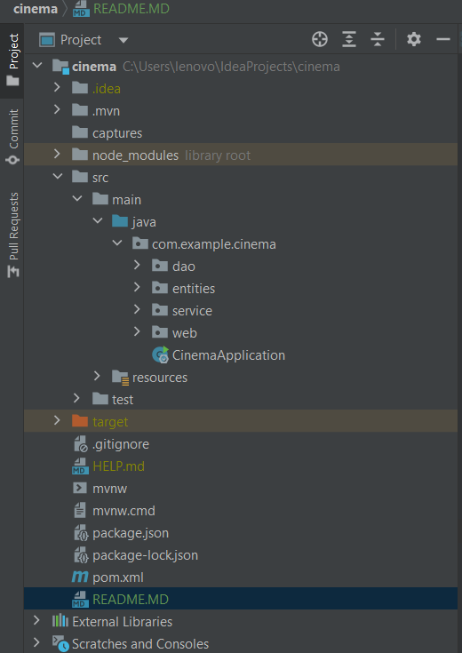

<h1>Cinema Management System</h1>

This cinema management system aims to provide users with a convenient platform to browse movies, check showtimes, and book seats, enhancing the overall cinema experience.

<h1>Features</h1>
<ul>
<li>Browse cinemas by city</li>
<li>View theaters in each cinema</li>   
<li>Check available movies in each theater</li>
<li>Reserve seats by seat name and payment code</li>
</ul>
<h1>Technologies Used</h1>
<ul>
<li>Java EE</li>
<li>Spring Boot</li>
<li>Spring Data JPA</li>
<li>Hibernate</li>
<li>MVC Architecture</li>
<li>MySQL</li>
</ul>
<h1>Packages and Classes</h1>
